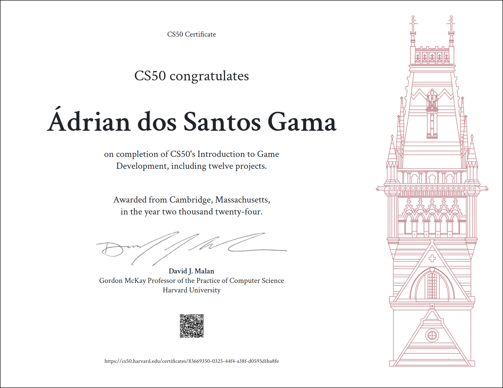

# CS50’s Introduction to Game Development (CS50G)

Before read this repository files, remember the [Academic Honesty](https://cs50.harvard.edu/x/honesty/).\
These files serve to give you a sense of how to do, iff, you feel lost in solving the problem.\
Don't copy and paste any of these files, try to solve any problems by yourself.

## Submissions

* Pong → [Submission](pong) and [Screencast](https://youtu.be/F9rwGeborvk)
* Flappy Bird → [Submission](flappy) and [Screencast](https://youtu.be/1p5GHHTBeCg)
* Breakout → [Submission](breakout) and [Screencast](https://youtu.be/QTfDsc9HDQg)
* Match 3 → [Submission](match) and [Screencast](https://youtu.be/ym-81XbEGvI)
* Super Mario Bros. → [Submission](mario) and [Screencast](https://youtu.be/-XjsKqaI6XI)
* Legend of Zelda → [Submission](zelda) and [Screencast](https://youtu.be/YxZW-YbEQOE)
* Angry Birds → [Submission](angry) and [Screencast](https://youtu.be/ZurAjopNQNw)
* Pokémon → [Submission](pokemon) and [Screencast](https://youtu.be/TIT_d20pZuU)
* Helicopter Game 3D → [Submission](helicopter) and [Screencast](https://youtu.be/S29ZDYpxwDg)
* Dreadhalls → [Submission](dreadhalls) and [Screencast](https://youtu.be/xidasbXpMnM)
* Portal → [Submission](portal) and [Screencast](https://youtu.be/3qnUjWxPenY)
* Final Project [Submission](https://github.com/jusqua/bytepath/tree/cs50-games) and [Screencast](https://youtu.be/lWH70MFXmsE)

## Certificate

